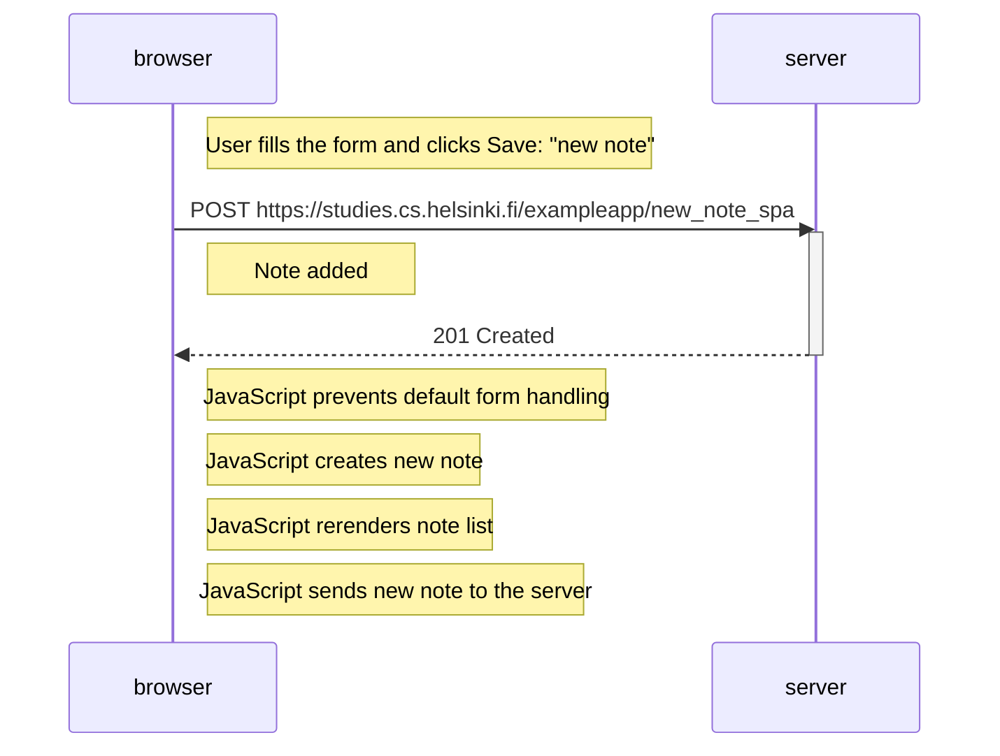

Chart for new note in single page app:

```mermaid
sequenceDiagram
    participant browser
    participant server

    Note right of browser: User fills the form and clicks Save: "new note"
    browser->>server: POST https://studies.cs.helsinki.fi/exampleapp/new_note_spa
    activate server
    Note right of browser: Note added
    server-->>browser: 201 Created
    deactivate server

    Note right of browser: JavaScript prevents default form handling
    Note right of browser: JavaScript creates new note
    Note right of browser: JavaScript rerenders note list
    Note right of browser: JavaScript sends new note to the server
```
