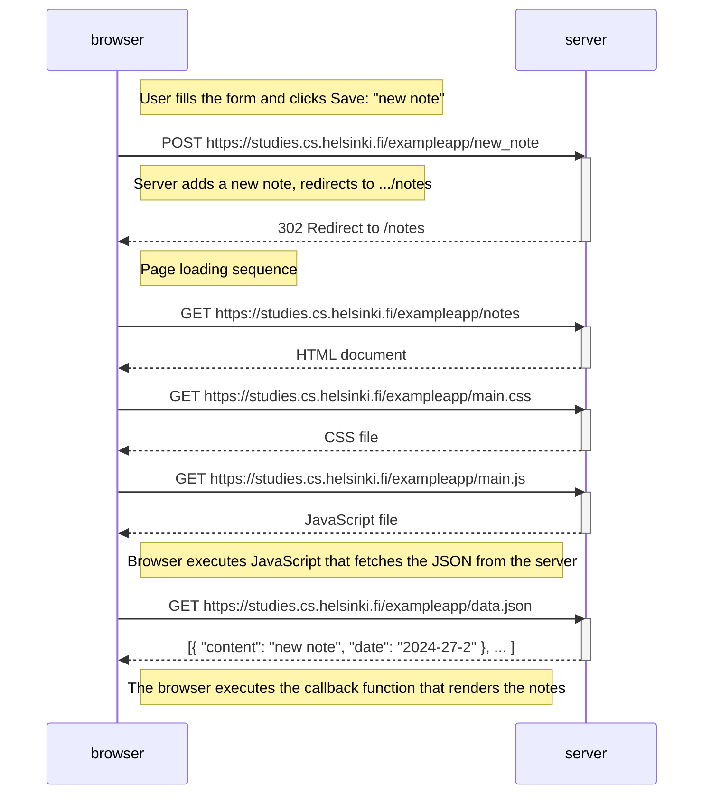

Chart for new note:

```mermaid
sequenceDiagram
    participant browser
    participant server

    Note right of browser: User fills the form and clicks Save: "new note"
    browser->>server: POST https://studies.cs.helsinki.fi/exampleapp/new_note
    activate server
    Note right of browser: Server adds a new note, redirects to .../notes
    server-->>browser: 302 Redirect to /notes
    deactivate server

    Note right of browser: Page loading sequence
    browser->>server: GET https://studies.cs.helsinki.fi/exampleapp/notes
    activate server
    server-->>browser: HTML document
    deactivate server

    browser->>server: GET https://studies.cs.helsinki.fi/exampleapp/main.css
    activate server
    server-->>browser: CSS file
    deactivate server

    browser->>server: GET https://studies.cs.helsinki.fi/exampleapp/main.js
    activate server
    server-->>browser: JavaScript file
    deactivate server

    Note right of browser: Browser executes JavaScript that fetches the JSON from the server
    
    browser->>server: GET https://studies.cs.helsinki.fi/exampleapp/data.json
    activate server
    server-->>browser: [{ "content": "new note", "date": "2024-27-2" }, ... ]
    deactivate server

    Note right of browser: The browser executes the callback function that renders the notes

```
